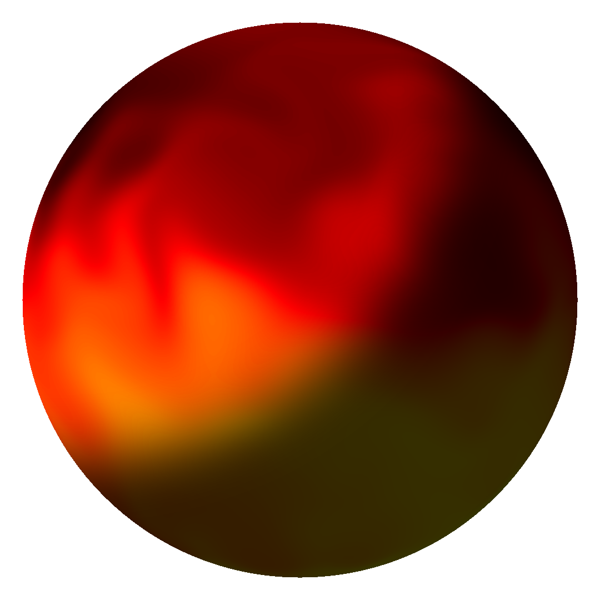

==========
Quickstart
==========

Generate a 2D planet sprite with masks
######################################

1. Import the library

.. code-block:: python

    from planet_generator import Client

2. Create a PlanetAPI client.

**Need an API key ?** Take a look at the `API main page`_ to get your API key.

.. code-block:: python

    planet_api = Client.from_api_key(
        api_key="YOUR API KEY HERE"
    )

3. Check if the API is up

You can optionally check if the API is running.

.. code-block:: python

    planet_api.get_status()

4. Generate a planet and apply masks

.. code-block:: python

    planet = planet_api.get_planet()
    sprite = planet.sprite.get_image(apply_masks=True)

Set `apply_masks` to `False` to get the sprite without any lightning and solar effect.

You can visualise the sprite directly in a notebook, or save it to a file:

.. _API main page: https://planet.joffreybvn.be/